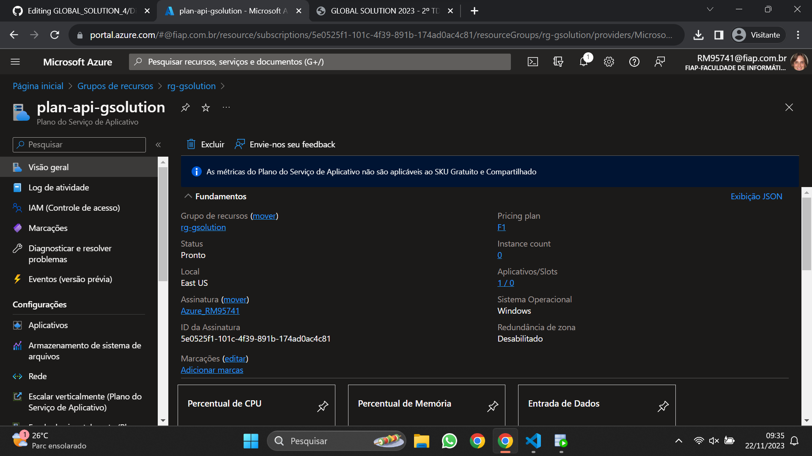

# Entregaveis da GS de DevOps

## Arquitetura do projeto

## Descrição do projeto e seus objetivos

## Prints da visão geral
<h3>Print da visão geral do grupo de recursos</h3>

<h3>Print da visão geral do plano do Serviço de Aplicativo</h3>

<h3>Print da visão geral do Serviço de Aplicativo</h3>

## Json
