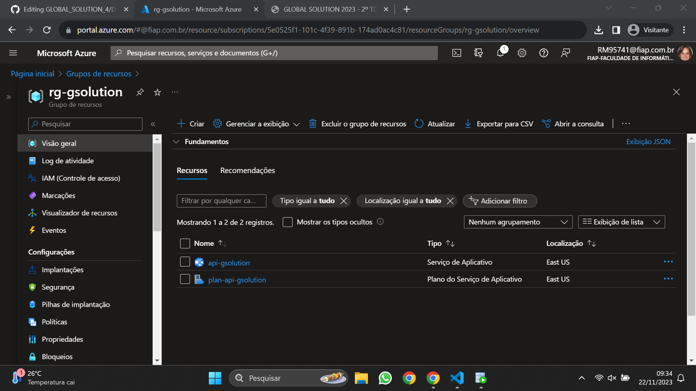

# Entregaveis da GS de DevOps

## Arquitetura do projeto


## Descrição do projeto e seus objetivos

O projeto propõe o desenvolvimento de um aplicativo inovador de saúde que utiliza dados de temperatura coletados por um sensor conectado a um dispositivo Arduino. Este aplicativo visa melhorar a eficiência no acompanhamento médico e no gerenciamento de pacientes. Ao integrar a tecnologia do sensor de temperatura, o sistema fornece informações valiosas para o médico, permitindo uma análise mais abrangente da condição de saúde do paciente. O objetivo principal do aplicativo é oferecer uma ferramenta abrangente para médicos gerenciarem as consultas e acompanharem o estado de saúde de seus pacientes de forma mais proativa.

## Prints da visão geral
<h3>Print da visão geral do grupo de recursos</h3>


<h3>Print da visão geral do plano do Serviço de Aplicativo</h3>


<h3>Print da visão geral do Serviço de Aplicativo</h3>


## Json

`GET` https://api-forall.azurewebsites.net/diary/list
```
[
	{
		"nmRemedio": "Joao",
		"descricaoRemedio": "Especialista em Cardiologia a mais de 5 anos ",
		"dtInicio": "2023-11-22",
		"dtTermino": "2023-11-22",
		"patientId": null
	},
	{
		"nmRemedio": "Alan",
		"descricaoRemedio": "Especialista em Neuro a mais de 8 anos ",
		"dtInicio": "2023-11-22",
		"dtTermino": "2023-11-22",
		"patientId": null
	},
	{
		"nmRemedio": "Valentina",
		"descricaoRemedio": "Especialista em Cardiologia a mais de 5 anos ",
		"dtInicio": "2023-11-22",
		"dtTermino": "2023-11-22",
		"patientId": null
	}
]
```

`GET` https://api-forall.azurewebsites.net/diary/{id}
```
    {
		"nmRemedio": "Joao",
		"descricaoRemedio": "Especialista em Cardiologia a mais de 5 anos ",
		"dtInicio": "2023-11-22",
		"dtTermino": "2023-11-22",
		"patientId": null
	}
```

`POST` https://api-forall.azurewebsites.net/diary
```
    {
		"nmRemedio": "Ana",
		"descricaoRemedio": "Especialista em Neurocirurgia a mais de 9 anos ",
		"dtInicio": "2023-11-22",
		"dtTermino": "2023-11-22",
		"patientId": null
	}
```

`PUT` https://api-forall.azurewebsites.net/diary/{id}
```
    {
		"nmRemedio": "Joao Marcelo",
		"descricaoRemedio": "Especialista em Cardiologia a mais de 7 anos ",
		"dtInicio": "2023-11-22",
		"dtTermino": "2023-11-22",
		"patientId": null
	}
```

`DELETE` https://api-forall.azurewebsites.net/diary/{id}

**Códigos de Respostas**
| código | descrição
| --- | ---
| 201 | sucesso
| 400 | erro na validação de dados da requisição
